# Purple Team Lab: Entra ID Attack Detection and Mitigation

> A cloud-native purple-team lab run against a live Microsoft Entra ID tenant. Two
> identity attacks are executed, detected with custom KQL in Microsoft Sentinel,
> promoted to live analytics rules, and mitigated with native Entra controls. Each
> attack ships as a complete trio: the attack, the detection, and the mitigation.


---

## Overview

Purple teaming is running an attack and building the defense for it in the same
exercise, so detection and response are proven against a real adversary technique
rather than assumed. This lab does that for two identity-focused attacks against
Microsoft Entra ID, entirely in the cloud with no on-premises infrastructure.

Every attack in this lab is delivered as a **trio**: the attack is executed against
a live tenant, a custom **KQL detection** is written against the resulting telemetry
in Microsoft Sentinel, that detection is promoted to a **live analytics rule** so it
alerts automatically, and a **native mitigation** is applied and verified. The
attacks are run only against the author's own tenant and test accounts.

## Detection pipeline

Entra ID audit and sign-in logs are streamed into a Log Analytics workspace via
diagnostic settings, and Microsoft Sentinel sits on top as the SIEM where detections
are written and operationalized as analytics rules.

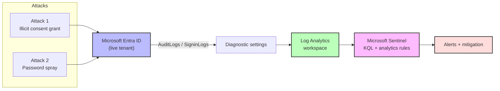

| Component | Role |
|-----------|------|
| Microsoft Entra ID (P2) | Target identity platform and log source |
| Diagnostic settings | Forwards AuditLogs and SigninLogs to the workspace |
| Log Analytics workspace | Stores the ingested identity telemetry |
| Microsoft Sentinel | SIEM: KQL detections and scheduled analytics rules |

---

## Detection environment

Before any attack, the logging pipeline is built and confirmed flowing, because
diagnostic settings only capture events created after they are enabled. Attacking
into a listening environment is what makes the telemetry available to detect.

<details>
<summary><b>Click to view detection environment setup</b></summary>

<br/>

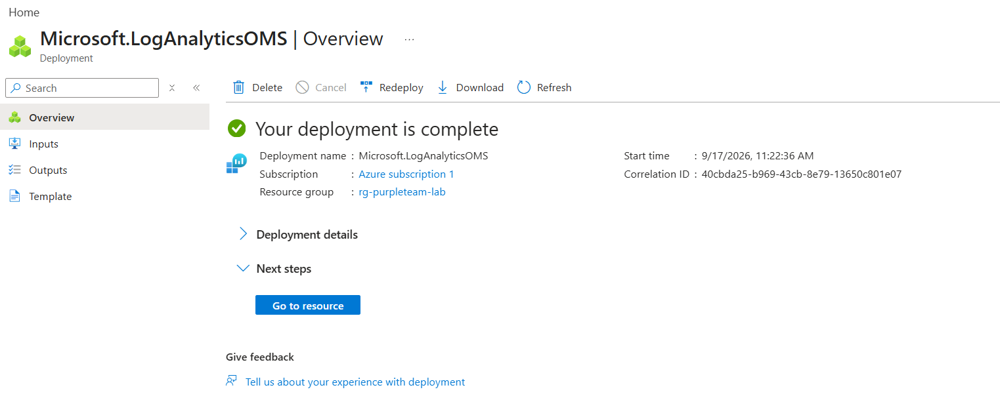

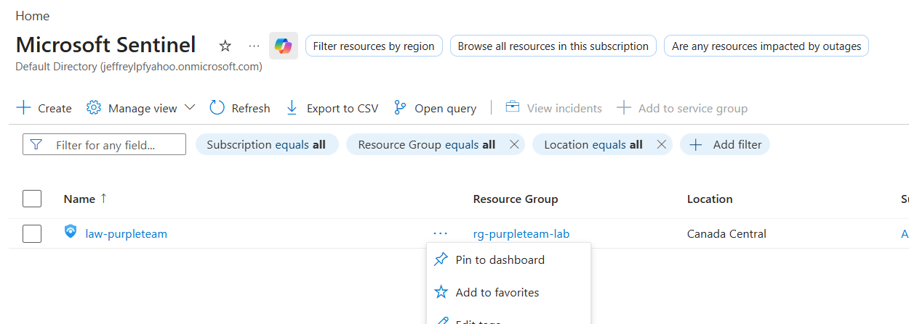

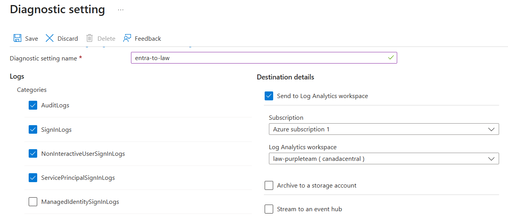

</details>

Logs confirmed flowing into the workspace before any attack was run:

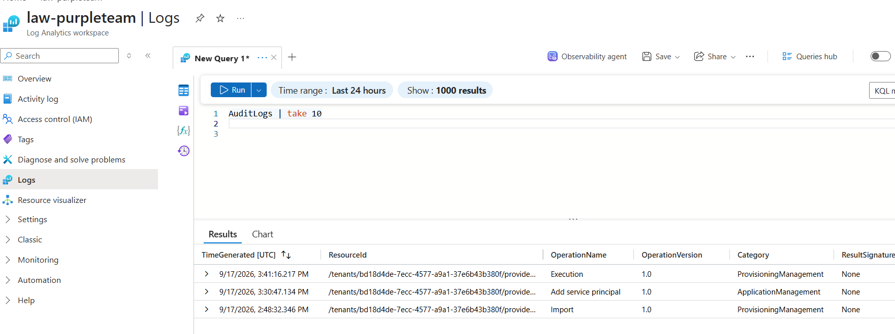

---

## Attack Chain 1: Illicit application consent grant

**Technique:** MITRE ATT&CK T1528 (Steal Application Access Token), via application
consent abuse.

An attacker registers an application that requests over-broad delegated Graph
permissions (here, `Mail.Read`) and obtains consent for it, gaining the ability to
read mailboxes across the tenant. In the classic form a user is phished into
consenting; this tenant already resisted user consent for sensitive scopes (a
correct secure default), so the attack is demonstrated in its higher-impact form: an
over-privileged app receiving **admin consent**, the scenario of a compromised or
careless administrator granting tenant-wide access.

### Attack

A malicious application is registered and requests `Mail.Read`, then receives
tenant-wide admin consent.

<details>
<summary><b>Click to view attack setup screenshots</b></summary>

<br/>

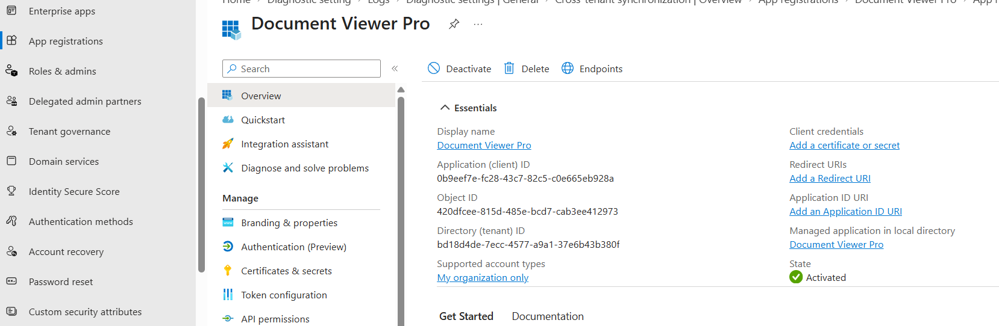

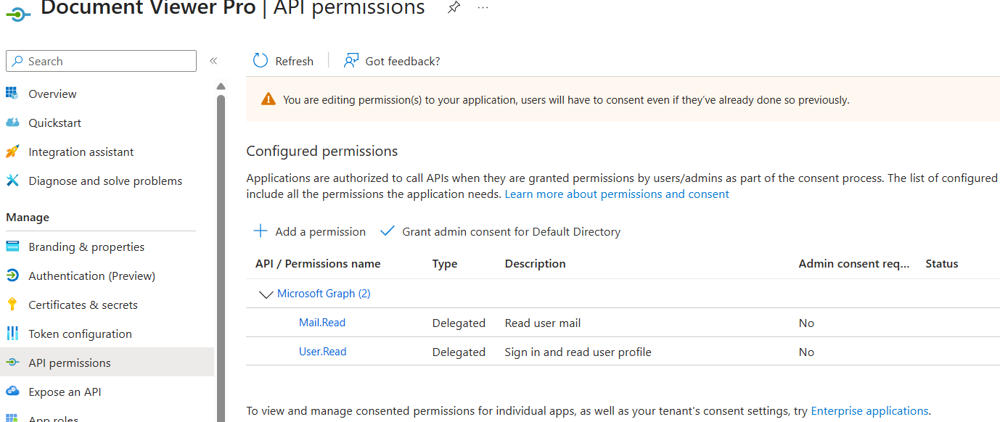

</details>

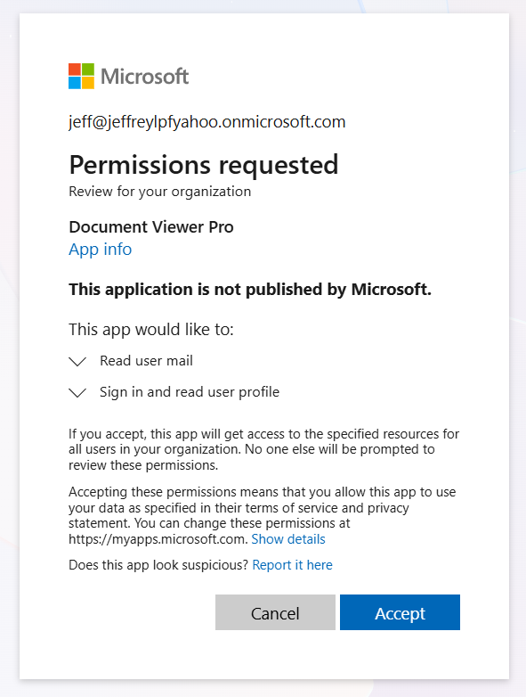

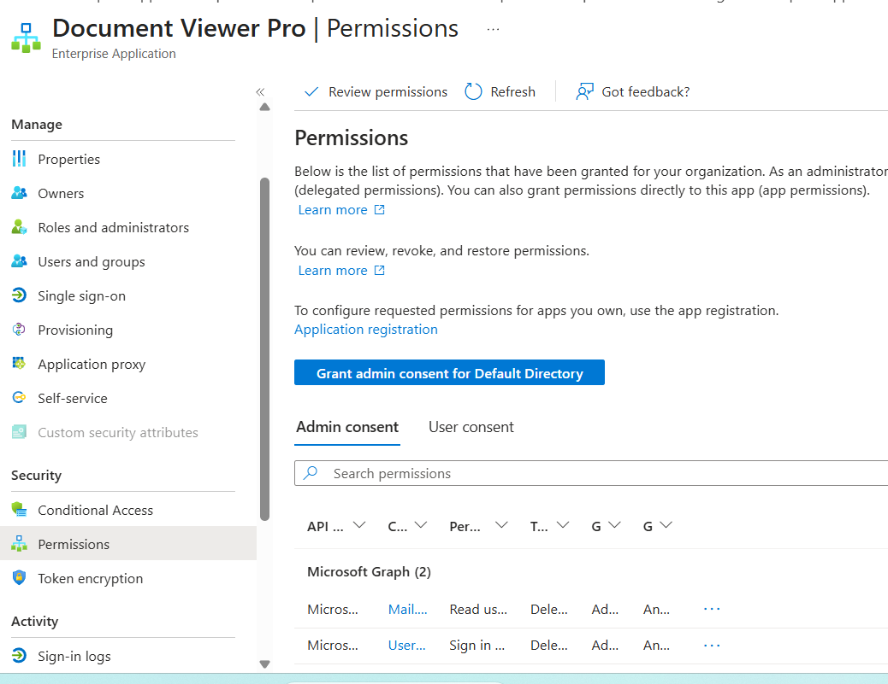

### Detection

A KQL query correlates the consent events (`Consent to application`, the app-role
grant, and the delegated permission grant) into a single recognizable pattern,
surfacing the app, the actor who granted consent, and the result.

```kusto
AuditLogs
| where OperationName in ("Consent to application", "Add app role assignment grant to user", "Add delegated permission grant")
| where TimeGenerated > ago(1h)
| extend App = tostring(TargetResources[0].displayName)
| extend Actor = tostring(InitiatedBy.user.userPrincipalName)
| project TimeGenerated, OperationName, App, Actor, Result
| sort by TimeGenerated desc
```

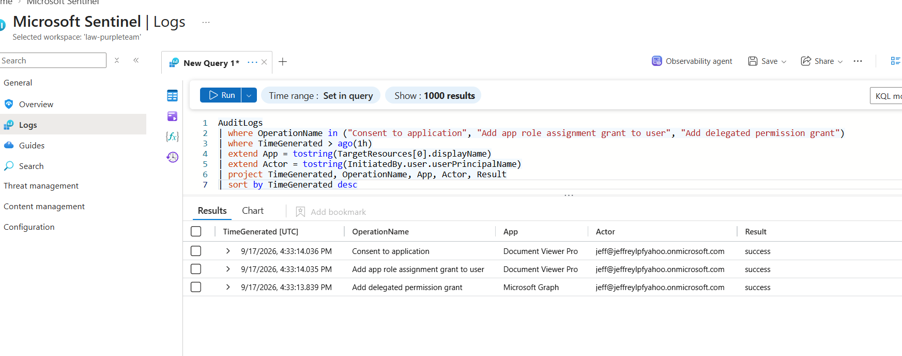

The query is promoted to a scheduled Microsoft Sentinel analytics rule so the
detection runs continuously and raises an incident automatically.

<p float="left">
  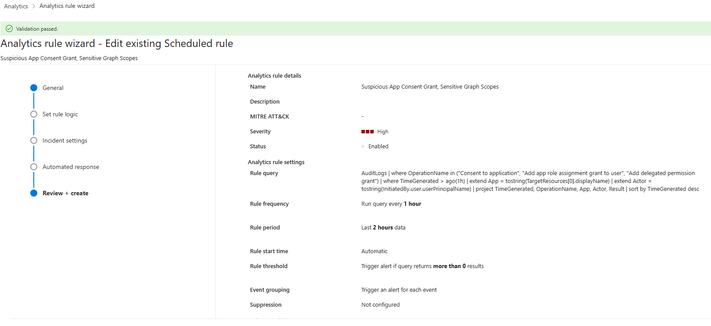
  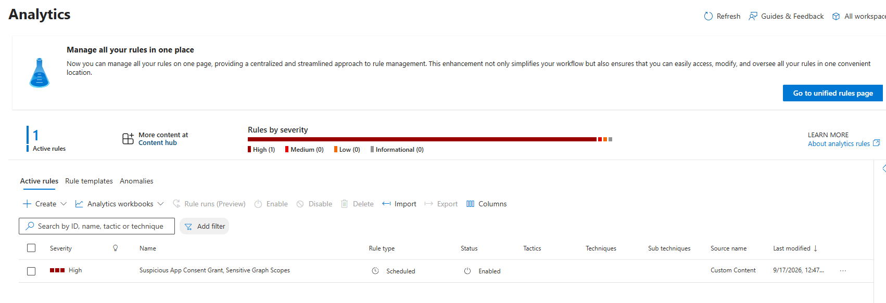
</p>

The rule configuration (left) and the active High-severity rule in Sentinel (right).

### Mitigation

Because admins can always grant consent, the control set is to restrict user consent
to sensitive scopes (already enforced in this tenant), require an admin consent
workflow so requests are reviewed rather than freely granted, and treat the analytics
rule above as the compensating detection for admin-granted consent, which a SOC
should alert on.

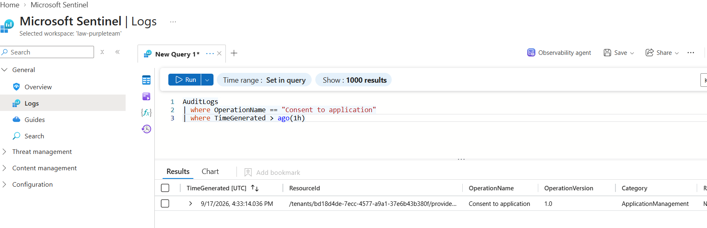

---

## Attack Chain 2: Password spray

**Technique:** MITRE ATT&CK T1110.003 (Brute Force: Password Spraying).

A password spray tries a single common password against many accounts from one
source, deliberately staying under per-account lockout thresholds to avoid tripping
brute-force defenses aimed at a single user. The attack is scripted against the
lab's own test accounts, producing a burst of failed sign-ins.

### Attack

A script attempts one common password across five test accounts, generating failed
authentications from a single source IP.

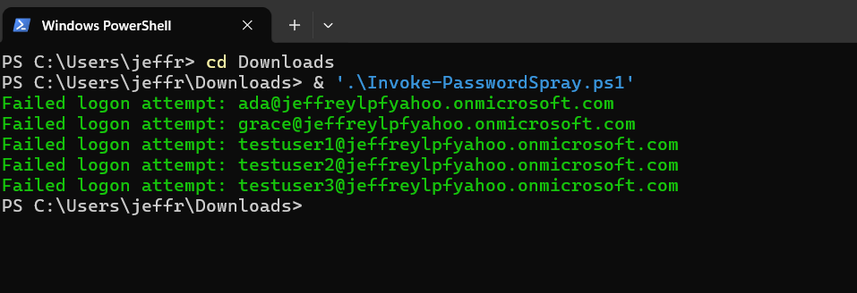

### Detection

A KQL query groups failed-credential sign-ins (`ResultType 50126`) by source IP and
flags any single source that failed against three or more distinct accounts in a
short window, the signature that distinguishes a spray from ordinary user error.

```kusto
SigninLogs
| where TimeGenerated > ago(1h)
| where ResultType == 50126
| summarize
    FailedAttempts = count(),
    TargetedAccounts = dcount(UserPrincipalName),
    Accounts = make_set(UserPrincipalName),
    FirstSeen = min(TimeGenerated),
    LastSeen = max(TimeGenerated)
    by IPAddress
| where TargetedAccounts >= 3
| sort by TargetedAccounts desc
```

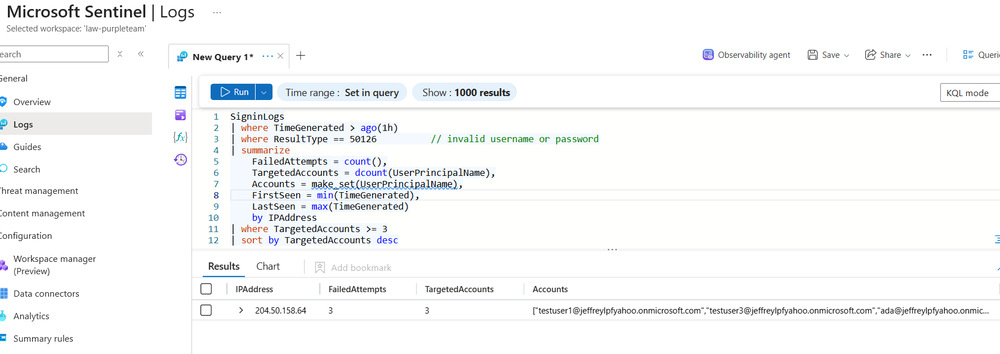

Promoted to a scheduled analytics rule so the spray is detected automatically:

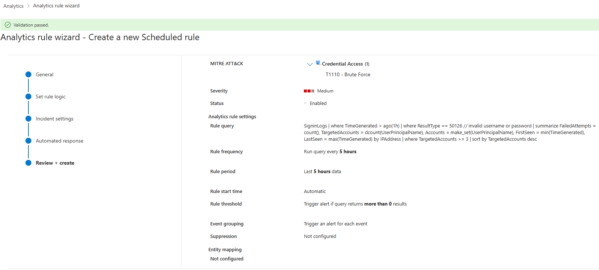

### Mitigation

Spray defense is layered. Smart lockout raises the cost of per-account guessing, but
because a spray spreads across many accounts to stay under lockout, the real defense
is multifactor authentication via Conditional Access, which stops a login from
succeeding even when a password is eventually guessed.

<p float="left">
  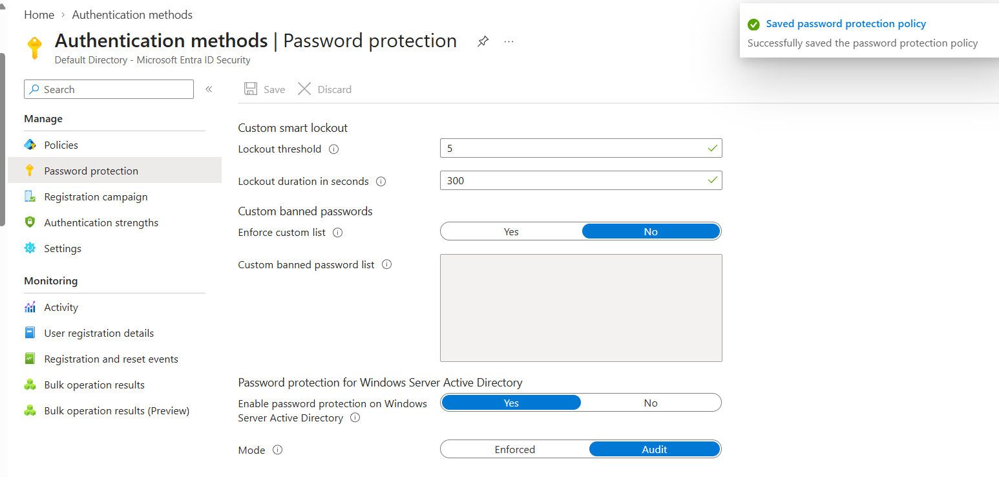
  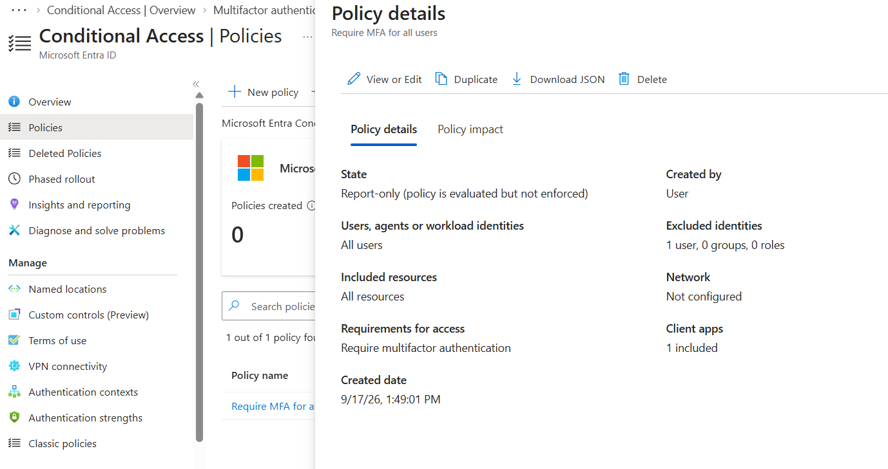
</p>

Smart lockout tuned (left) and a Conditional Access policy requiring MFA, with a
break-glass exclusion, as the primary spray defense (right).

---

## Key Concepts Demonstrated

Cloud-native purple teaming; Microsoft Entra ID identity attacks (application consent
abuse and password spraying); log pipeline design (diagnostic settings to Log
Analytics to Microsoft Sentinel); custom KQL detection authoring; promoting detections
to scheduled Sentinel analytics rules; MITRE ATT&CK mapping (T1528, T1110.003); and
layered native mitigation (consent restriction and admin consent workflow, smart
lockout, and MFA via Conditional Access).

## Why this matters (defensive value)

- **Application consent abuse** turns a single consent grant into standing,
  tenant-wide access to data such as mailboxes, and it survives password changes
  because it rides an OAuth token rather than a credential. Detecting and reviewing
  consent grants is the control that catches it.
- **Password spraying** is one of the most common initial-access techniques against
  identity providers precisely because it evades single-account lockout. MFA via
  Conditional Access is what neutralizes it, and detection on failed-sign-in patterns
  gives early warning.
- Building the detection and the mitigation alongside the attack is what proves a
  control works, rather than assuming it does.

## Skills Demonstrated

- Microsoft Sentinel: workspace and SIEM setup, KQL detection engineering, scheduled
  analytics rules
- Microsoft Entra ID security: application consent controls, Conditional Access,
  password protection and smart lockout
- Identity attack execution and analysis (consent abuse, password spray)
- MITRE ATT&CK mapping of detections to techniques
- End-to-end telemetry pipeline design (diagnostic settings to Log Analytics)

## Tech Stack

Microsoft Entra ID (P2), Microsoft Sentinel, Azure Log Analytics, Kusto Query
Language (KQL), PowerShell.

## Repository Contents

- `queries/` — the KQL detection queries for both attack chains
- `scripts/` — the password-spray script used to generate spray telemetry (lab use,
  own tenant only)
- `screenshots/` — evidence for each stage of both trios

## Responsible Use

Every attack in this lab was executed by the author against the author's own Entra ID
tenant and disposable test accounts, for the sole purpose of building and validating
detections. The over-permissioned application was revoked and test artifacts cleaned
up after evidence was captured. Nothing here should be run against any environment you
do not own and are not authorized to test.

## About

Built by Jeffrey Lam-Ping-Fong, a fourth-year Honours Bachelor of Information
Technology student specializing in cybersecurity, with a focus on identity and
access management.

- LinkedIn: https://www.linkedin.com/in/jeffrey-lam-ping-fong-07a649321
